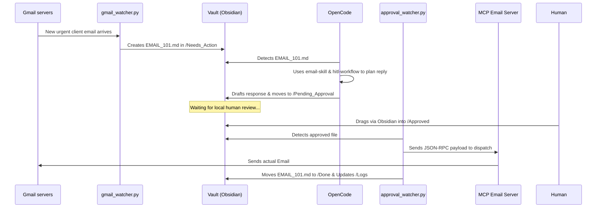
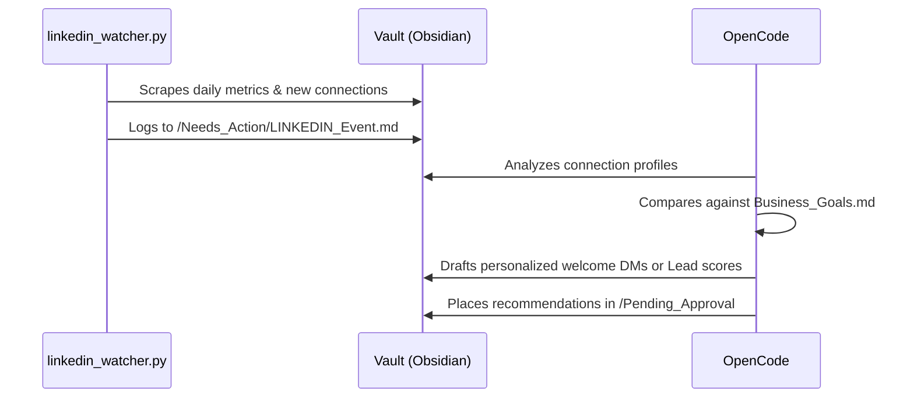
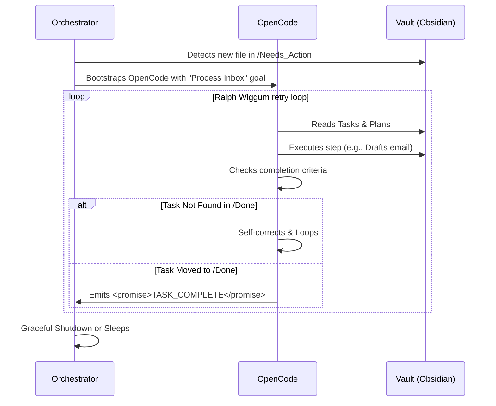

# Personal AI Employee

> Local-first, human-in-the-loop autonomous agent. It watches your inbox and business signals, drafts the response, and waits for you to approve it before anything real happens.


## Quick start

```bash
git clone https://github.com/AbdulSamad94/Personal-AI-Employee.git
cd Personal-AI-Employee
uv sync
cp .env.example .env   # fill in your credentials — see Setup & Installation below
python orchestrator.py # boots the watchers
opencode run "Process all pending tasks in vault/Needs_Action/" --auto
```

That's the whole loop in one shot. Full setup (Gmail OAuth, Telegram/Discord approval bots, etc.) is in [Setup & Installation](#setup--installation).

## Table of Contents

- [What this is](#what-this-is)
- [Core Architecture](#core-architecture)
- [Project Status](#project-status)
- [Codebase & Vault Structure](#codebase--vault-structure)
- [Setup & Installation](#setup--installation)
- [Application Workflows](#application-workflows)
- [Security & Privacy Posture](#security--privacy-posture)
- [Permission Policy](#permission-policy)
- [The "Ralph Wiggum" Retry Loop](#the-ralph-wiggum-retry-loop)
- [Error Handling — current vs. planned](#error-handling--current-vs-planned)
- [Troubleshooting / FAQ](#troubleshooting--faq)
- [Contributing](#contributing)

## What this is

Most "AI agent" products are a black box: you give a SaaS tool your credentials and hope it does the right thing. This project takes the opposite approach — every piece of state the agent knows or plans is a plain Markdown file you can read, edit, or delete yourself, and nothing irreversible (sending an email, posting socially, moving money) happens without you physically approving the draft first.

It runs entirely on your own machine, uses a local [OpenCode](https://opencode.ai) agent for reasoning, and keeps its entire memory in an Obsidian vault.

## Core Architecture

The system follows a **Perception → Reasoning → Action** loop.


### 1. The Senses (Watchers)
Lightweight Python background scripts (`/watchers/`) acting as the system's eyes and ears. Managed by `orchestrator.py`, they scan APIs and filesystems, transforming external events into Markdown files dropped into the Obsidian Vault.

### 2. The Brain & Memory
- **The Brain**: OpenCode runs in a continuous loop. Woken by new files in `Needs_Action`, it leverages custom **Agent Skills** (`.agents/skills/`) to break down complex tasks and draft solutions.
- **The Memory**: The Obsidian Vault (`/vault/`) acts as the state machine, config layer, and audit log. Everything the AI knows or plans is visible as local, editable text.

### 3. The Hands (MCP & HITL)
- **Model Context Protocol (MCP)**: Standardized servers (`/mcp_servers/`) that expose external tools (like sending Gmail, posting socially, accessing Odoo) to OpenCode. See [Project Status](#project-status) — not all of these are wired up or safe to use yet.
- **Human-In-The-Loop (HITL)**: The AI writes draft actions to `/Pending_Approval`. Actions strictly wait for a human to drag the file to `/Approved` before the `approval_watcher` executes them.

---

## Project Status

Being upfront about what actually works vs. what's scaffolding, so you don't wire something up expecting it to be production-ready:

| Component | Status | Notes |
| :--- | :--- | :--- |
| Gmail watcher + triage | ✅ Working, multi-account | Polls for priority mail across multiple Gmail accounts (`GMAIL_ACCOUNT_LABEL` env var), drafts replies via `email-skill` from the matching address, routes through HITL approval. |
| LinkedIn watcher | ✅ Working | Monitors connections/messages, drafts outreach for approval. |
| Filesystem watcher | ✅ Working | Event-driven (watchdog-based) ingestion of dropped files. |
| Approval workflow | ✅ Working | The `Pending_Approval → Approved → Done` gate is enforced in code, not just policy. Three independent approval paths: drag-and-drop (Obsidian), Telegram bot, Discord bot — any one moves the file. |
| Telegram/Discord approval bots | ✅ Working | Push a notification with Approve/Reject/Request Changes buttons the moment a draft is ready — no manual file dragging needed. Both run in parallel as redundant channels (useful if one platform is blocked on your network); see `CONTRIBUTING.md` for bot setup. |
| Email MCP server | ✅ Working, wired up | Registered in `opencode.json`, respects `DRY_RUN`, supports sending from multiple configured accounts. |
| Odoo accounting MCP | ⚠️ Exists, not wired up, no safety gate | `mcp_servers/odoo_mcp.py` can create/write/delete any Odoo record with no `DRY_RUN` check or approval requirement in code — only a prompt-level instruction in its skill. Don't register it in `opencode.json` until that's fixed. |
| Social media MCP | ⚠️ Stub | `mcp_servers/socials_mcp.py` logs posts to a local JSON file and always reports success — it does not call any real Facebook/Instagram/Twitter API yet. |
| WhatsApp watcher | ❌ Not built | Referenced in early planning docs, never implemented. |
| Weekly CEO Briefing | ✅ Working | Audits `Business_Goals.md` and generates a summary in `vault/Briefings/`. |
| Windows Task Scheduler integration | ✅ Working, Windows-only | `scheduler/setup_task.ps1` registers a recurring job, wakes the machine from sleep to run. No Linux/Mac equivalent yet (cron/launchd). |

---

## Codebase & Vault Structure

```text
/personal-ai-employee
├── .env                        # Environment Secrets (DO NOT COMMIT)
├── opencode.json               # OpenCode config: model, MCP servers, permissions
├── orchestrator.py             # Main entry point: Runs all background watchers continuously
├── vault/                      # 🧠 The Obsidian Vault (System State & Memory)
│   ├── Inbox/                  # Raw drops
│   ├── Needs_Action/           # Tasks awaiting OpenCode's attention
│   ├── Pending_Approval/       # OpenCode's drafted tasks awaiting human approval
│   ├── Approved/               # Human-approved tasks waiting for execution watcher
│   ├── Done/ & Logs/           # History of completed actions
│   ├── Company_Handbook.md     # Rules of behavior for the AI
│   ├── Business_Goals.md       # KPIs and targets for autonomous audits
│   └── Dashboard.md            # Real-time state overview
├── watchers/                   # 👀 The Senses — active Python background scripts
│   ├── gmail_watcher.py        # Monitors unread priority emails (multi-account via GMAIL_ACCOUNT_LABEL)
│   ├── linkedin_watcher.py     # Monitors LinkedIn connections/messages
│   ├── filesystem_watcher.py   # Event-driven local file ingester
│   ├── approval_watcher.py     # Executes tasks dropped in /Approved
│   ├── telegram_approval_watcher.py  # Pending_Approval → Telegram Approve/Reject/Edit ping
│   └── discord_approval_watcher.py   # Pending_Approval → Discord Approve/Reject/Edit ping
├── .agents/skills/             # 🛠️ OpenCode's Reasoning capabilities
│   ├── hitl-workflow/          # Logic for requesting human permissions
│   ├── email-skill/            # Logic for drafting, triaging emails
│   ├── linkedin-skill/         # Logic for B2B lead generation & posting
│   ├── ceo-briefing/           # Logic for weekly audits
│   ├── odoo-accounting/        # Logic for ERP connections
│   ├── social-manager/         # Logic for social media PR
│   ├── reasoning-loop/         # Deep multi-step task planning
│   └── ...
└── mcp_servers/                # 👐 The Hands
    ├── email/                  # Python MCP Server for Gmail
    ├── odoo_mcp.py             # Python MCP Server for local Odoo APIs (unwired, unsafe — see status table)
    └── socials_mcp.py          # Python MCP Server for FB/IG/Twitter (stub — see status table)
```

---

## Setup & Installation

### Prerequisites
1. **Python 3.11+**
2. **[OpenCode](https://opencode.ai)** installed (`npm install -g opencode-ai`)
3. **Obsidian** (optional, for viewing the `/vault` visually)

### Step-by-Step

1. **Clone & install dependencies**
    ```bash
    git clone https://github.com/AbdulSamad94/Personal-AI-Employee.git
    cd Personal-AI-Employee
    uv sync
    ```

2. **Configure environment variables**
    ```bash
    cp .env.example .env
    ```
    Then fill in the values you need — `.env.example` documents every variable, including which are optional (second Gmail account, Telegram/Discord bots, Odoo). At minimum you need `GMAIL_USER`/`GMAIL_APP_PASSWORD` to get started; leave `DRY_RUN=true` until you've reviewed what the agent does.

3. **Initialize the orchestrator**
    Boots all background watchers. Leave it running in a terminal.
    ```bash
    python orchestrator.py
    ```

4. **Boot up OpenCode**
    In a second terminal:
    ```bash
    opencode
    > "Trigger the process-tasks skill to empty the Needs_Action folder."
    ```
    Or run it non-interactively (what the scheduled task does):
    ```bash
    opencode run "Process all pending tasks in vault/Needs_Action/..." --auto
    ```

---

## Application Workflows

### Secure Email Triage (Human-In-The-Loop)



### Automated LinkedIn Lead Generation



---

## Security & Privacy Posture

- **Zero-cloud memory**: all internal state lives in local Markdown files inside `/vault`. You own the data.
- **HITL by default**: the AI uses the `/Pending_Approval` workflow. No irreversible API calls (payments, outgoing emails, social posts) trigger without an explicit, manual file move — this is enforced in `approval_watcher.py`, not just a policy statement.
- **Dry-run sandbox**: set `DRY_RUN=true` in `.env` to log intended actions without actually sending/posting anything, useful while testing changes.
- **Known gap**: the Odoo MCP server has no code-level dry-run/approval check (see [Project Status](#project-status)) — don't wire it into `opencode.json` for real financial data until that's fixed.

## Permission Policy

The intended action thresholds, as defined in `vault/Company_Handbook.md`. Today these are enforced through the Handbook + skill instructions the agent reads before acting, not hard-coded checks — treat this as policy the agent is instructed to follow, not a guarantee:

| Action Category | Auto-Approve Threshold | Always Requires Manual Approval |
| :--- | :--- | :--- |
| Email Replies | Known contacts (whitelisted domains) | New contacts, bulk sends, sensitive topics |
| Social Media | Scheduled "evergreen" posts | Real-time replies, DMs, sponsored content |
| Payments | Recurring bills < $50 | All new payees, transfers > $100 |
| File Ops | Reading, creating in vault | Deleting, moving files outside the vault |

## The "Ralph Wiggum" Retry Loop

`scripts/ralph_loop.ps1` keeps OpenCode working a single task until it's actually moved to `vault/Done/`, instead of accepting the first response as complete — this fights the "lazy agent" problem where a model claims a task is done without doing it.



## Error Handling — current vs. planned

**What's actually implemented today**: `orchestrator.py` acts as a watchdog process, monitoring the PIDs of all watchers and auto-restarting any that exit with a non-zero code. Watchers catch and log exceptions broadly to stay alive across transient failures.

**Not yet implemented** (roadmap, not current behavior): exponential backoff on retried API calls, and automatic quarantine of a task into an `ALERT_HUMAN.md` file after repeated failures. If you build these, they'd slot naturally into the watcher poll loops and `approval_watcher.py`.

---

## Troubleshooting / FAQ

**Gmail OAuth fails with "Access blocked: has not completed the Google verification process" / Error 403.**
Your Google Cloud OAuth app is in "Testing" mode, which only allows explicitly allow-listed accounts to log in. Go to [Google Cloud Console](https://console.cloud.google.com) → APIs & Services → OAuth consent screen → Test users → add the Gmail address you're trying to authorize, then retry.

**Telegram bot never sends notifications, even though the token/chat ID are correct.**
Telegram is intermittently blocked at the network/ISP level in some regions (Pakistan's PTA, for one). Check with `curl -sS -o /dev/null -w "%{http_code}\n" https://api.telegram.org` — if it hangs or times out, that's the cause, not a bug. The watcher degrades gracefully (retries automatically, doesn't crash) — if you need a channel that works right now, set up the Discord bot as a redundant path (both are supported side by side; see `CONTRIBUTING.md`).

**Discord bot connects but "Request Changes" text replies don't get picked up.**
The bot needs the **Message Content Intent** enabled in the [Discord Developer Portal](https://discord.com/developers/applications) (Bot tab) — Discord doesn't let a bot read message content by default. Buttons (Approve/Reject) still work without it; only free-text replies need it.

**Scheduled task runs on Windows but nothing seems to happen.**
Check `vault/Logs/scheduler.log` first — it logs every run's outcome. If you see `%1 is not a valid Win32 application`, that's a known Windows quirk with how `opencode` resolves (fixed as of this repo's current `run_agent.ps1`, but worth checking if you've forked/modified it).

**I get duplicate task files / the same event processed twice.**
Almost always means two orchestrator processes are running at once (e.g. from overlapping scheduled runs). Check with `Get-CimInstance Win32_Process -Filter "name='python.exe'" | Where-Object { $_.CommandLine -match 'orchestrator.py' }` — you should see exactly one. `run_agent.ps1` uses a named Mutex to prevent this, but if you're invoking `orchestrator.py` manually alongside the scheduled task, you can still hit it.

---

## Contributing

Issues and PRs welcome — see [`CONTRIBUTING.md`](./CONTRIBUTING.md) for dev setup, where things live, and a list of good first contributions (the Odoo safety gate is the highest-value one). Licensed under MIT — see `LICENSE`.
