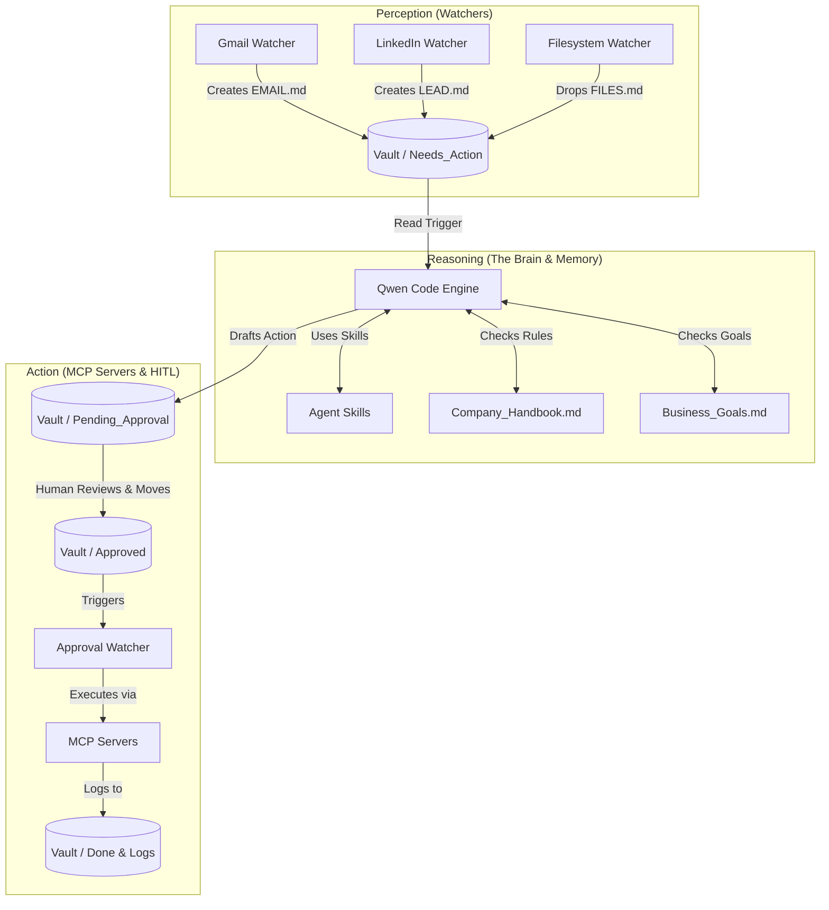
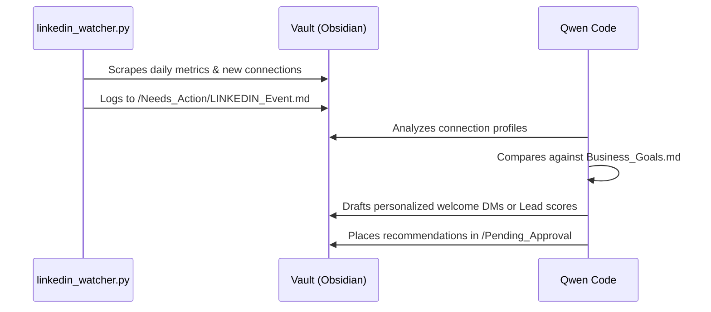
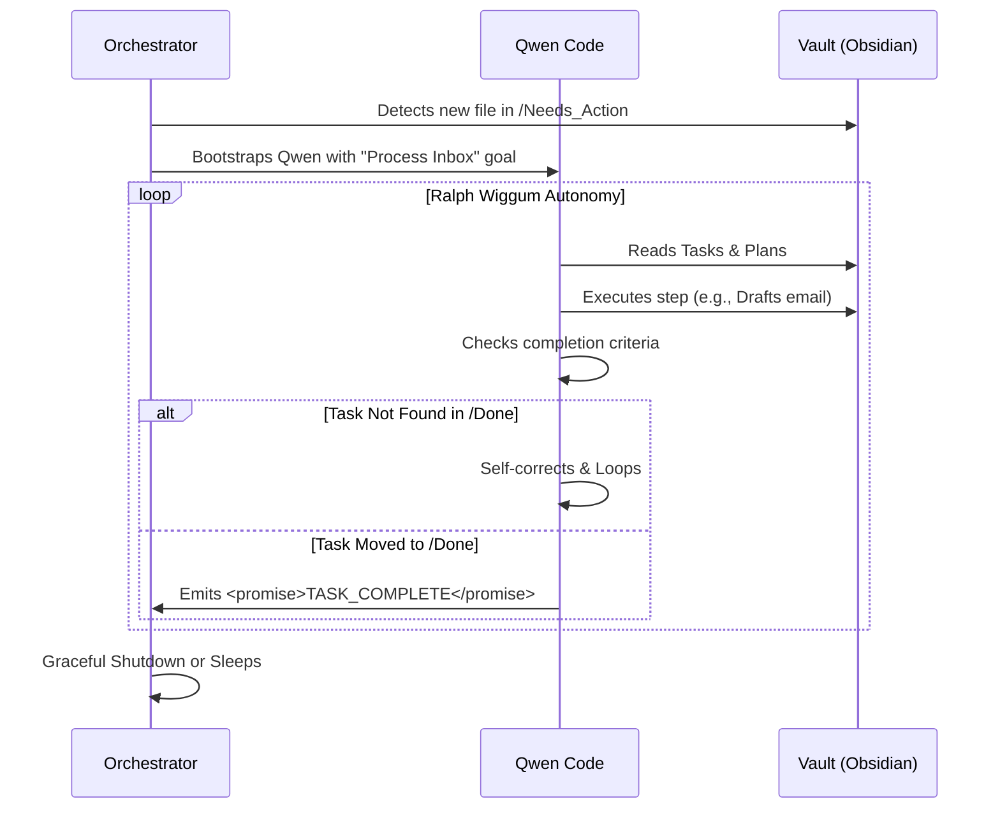

# Personal AI Employee: Digital FTE (Full-Time Equivalent) 
**Hackathon 0: Building Autonomous FTEs in 2026**

> **Tagline:** Your life and business on autopilot. Local-first, agent-driven, human-in-the-loop.


## 📖 Executive Summary
Welcome to the future of personal automation. This project shifts the conversation from "software licenses" to "headcount budgets" by acting as a **Digital Full-Time Equivalent (FTE)**. It is a local-first, privacy-focused autonomous system that proactively manages your personal affairs (email management, local file sorting) and business operations (social media presence, approval workflows) 24/7.

Unlike traditional chatbots, this AI doesn't wait for you to type. It uses a **Perception → Reasoning → Action** architecture to continuously watch for events, plan solutions using Qwen Code's advanced reasoning capabilities, and execute actions via external integrations.

---

## 🏗️ Core Architecture 

The architecture is built on three pillars to ensure robust, autonomous, yet safe operations.



### 1. The Senses (Watchers)
Lightweight Python background scripts (`/watchers/done/`) acting as the system's eyes and ears. Managed by `orchestrator.py`, they scan APIs and filesystems, transforming external events into Markdown files dropped into the Obsidian Vault.

### 2. The Brain & Memory
- **The Brain**: Qwen Code runs in a continuous loop. Woken by new files in `Needs_Action`, it leverages custom **Agent Skills** (`.agents/skills/`) to break down complex tasks and draft solutions.
- **The Memory**: The Obsidian Vault (`/vault/`) acts as the state machine, config layer, and audit log. Everything the AI knows or plans is visible as local, editable text.

### 3. The Hands (MCP & HITL)
- **Model Context Protocol (MCP)**: Standardized servers (`/mcp_servers/`) that expose external tools (like sending Gmails, posting Socials, accessing Odoo) safely to Qwen.
- **Human-In-The-Loop (HITL)**: Crucial for security. The AI writes draft actions to `/Pending_Approval`. Actions strictly wait for a human to drag the file to `/Approved` before the `approval_watcher` executes them.

---

## 📂 Codebase & Vault Structure

```text
/hackathon-0
├── .env                        # Environment Secrets (DO NOT COMMIT)
├── orchestrator.py             # Main entry point: Runs all background watchers continuously
├── vault/                      # 🧠 The Obsidian Vault (System State & Memory)
│   ├── Inbox/                  # Raw drops
│   ├── Needs_Action/           # Tasks awaiting Qwen's attention
│   ├── Pending_Approval/       # Qwen's drafted tasks awaiting human approval
│   ├── Approved/               # Human-approved tasks waiting for execution watcher
│   ├── Done/ & Logs/           # History of completed actions
│   ├── Company_Handbook.md     # Rules of behavior for the AI
│   ├── Business_Goals.md       # KPIs and targets for autonomous audits
│   └── Dashboard.md            # Real-time state overview
├── watchers/                   # 👀 The Senses
│   ├── done/                   # Active Python background scripts
│   │   ├── gmail_watcher.py    # Monitors unread priority emails
│   │   ├── linkedin_watcher.py # Monitors LinkedIn connections/messages
│   │   ├── filesystem_watcher.py  # Event-driven local file ingester
│   │   └── approval_watcher.py # Executes tasks dropped in /Approved
│   └── todo/                   # Stubs for upcoming (Gold tier) features
├── .agents/skills/             # 🛠️ Qwen's Reasoning capabilities
│   ├── hitl-workflow/          # Logic for requesting human permissions
│   ├── email-skill/            # Logic for drafting, triaging emails
│   ├── linkedin-skill/         # Logic for B2B lead generation & posting
│   ├── ceo-briefing/           # Logic for Weekly Audits
│   ├── odoo-accounting/        # Logic for ERP connections
│   ├── social-manager/         # Logic for Social Media PR
│   ├── reasoning-loop/         # Deep multi-step task planning
│   └── ...
└── mcp_servers/                # 👐 The Hands
    ├── email/                  # Python MCP Server for Gmail
    ├── odoo_mcp.py             # Python MCP Server for local Odoo 19 APIs
    └── socials_mcp.py          # Python MCP Server for FB/IG/Twitter
```

---

## 🚀 Setup & Installation Guide

Estimated setup time: 10-15 minutes.

### Prerequisites
1. **Python 3.11+**
2. **Qwen Code** installed and authenticated (`npm install -g qwen`)
3. **Obsidian** (Optional but highly recommended for viewing the `/vault` dashboard)

### Step-by-Step

1. **Clone & Install Dependencies**
    ```bash
    git clone https://github.com/YourName/Personal-AI-Employee.git
    cd Personal-AI-Employee
    pip install -r requirements.txt
    ```

2. **Configure Environment Variables**
    Create a `.env` file at the root. *Security Note: Never commit this file. Add it to `.gitignore`.*
    ```env
    # Email Watcher & MCP
    GMAIL_USER=your_email@gmail.com
    GMAIL_APP_PASSWORD=your_16_digit_app_password
    
    # LinkedIn Watcher integration
    LINKEDIN_TOKEN=your_oauth2_token
    LINKEDIN_PERSON_ID=your_id

    # Master Safetys
    DRY_RUN=true # Set to false to allow actual physical API executions
    ```

3. **Initialize the Orchestrator**
    This master script boots up all your background Python watchers. Leave it running in a terminal.
    ```bash
    python orchestrator.py
    ```

4. **Boot up the Employee (Qwen Code)**
    Open a *second* terminal to wake the brain up. Instruct Qwen to clear the inbox.
    ```bash
    qwen
    > "Trigger the process-tasks skill to empty the Needs_Action folder."
    ```

---

## 🚦 Application Workflows

### 🛡️ Secure Email Triage (Human-In-The-Loop)
This demonstrates how the agent safely drafts outgoing communication.


### 💼 Automated LinkedIn Lead Generation


---

## 🔐 Security & Privacy Posture
When handing control of your inbox and business to an AI, security is mission-critical:
- **Zero-Cloud Memory**: All internal state lives in local Markdown files inside `/vault`. You own the data.
- **HITL by Default**: The AI uses the `/Pending_Approval` workflow. No irreversible API calls (Payments, Outgoing Emails, Social Posts) trigger without explicit dragged-and-dropped manual approval.
- **Dry-Run Sandbox**: Development happens with `DRY_RUN=true` ensuring safety during component testing.

---

## 🏅 Hackathon Tier Roadmap

| Tier | Status | Deliverables |
| :-- | :--: | :-- |
| **Bronze (Foundation)** | ✅ | Local Obsidian Vault, Dashboard, Company Handbook, basic Folder structure. |
| **Silver (Functional)** | ✅ | 2+ Watcher scripts (Gmail, LinkedIn, File). MCP Server implementation. Reasoning loops via Agent Skills. Full working approval workflow. |
| **Gold (Autonomous)** | ✅ | Odoo ERP integration (Accounting MCP). End-to-end Weekly CEO Briefing (Auditing `Business_Goals.md`). Social media posting. Graceful Error Handling. |
| **Platinum (Cloud)** | ⏳ | Splitting the brain. Deploying a Cloud VM 24/7 for drafting, syncing to the Local Vault via Git strictly for HITL approvals. |

---

## 🔁 Autonomy & The "Ralph Wiggum" Loop
To achieve true autonomy (Gold Tier), the agent uses a **Continuous Reasoning Loop**. This prevents the "lazy agent" problem by ensuring Qwen continues working until a specific condition is met.



---

## 🔐 Security Permission Boundaries
Safety is managed through strict action thresholds.

| Action Category | Auto-Approve Threshold | Always Require Manual Approval |
| :--- | :--- | :--- |
| **Email Replies** | Known contacts (Whitelisted domains) | New contacts, Bulk sends, Sensitive topics |
| **Social Media** | Scheduled "Evergreen" posts | Real-time replies, DMs, Sponsored content |
| **Payments** | Recurring bills < $50 | All new payees, Transfers > $100 |
| **File Ops** | Reading, Creating in Vault | Deleting, Moving files outside the Vault |

---

## 🛠️ Error States & Recovery Strategy
The AI Employee is designed for graceful degradation.

1. **Transient Errors (API Timeouts)**: Implemented using **Exponential Backoff**. 
   - *Attempt 1*: 1s delay | *Attempt 2*: 4s delay | *Attempt 3*: 16s delay.
2. **Logic Errors (Misinterpretation)**: If Qwen fails a task 3 times, it automatically quarentines the task and creates an `ALERT_HUMAN.md` file in the `/Needs_Action` folder.
3. **System Crashes**: The `orchestrator.py` acts as a **Watchdog Process**, monitoring the PIDs of all watchers and auto-restarting them if they exit with a non-zero code.

---

*Built with precision for Hackathon 0. The Future of Work is Autonomous.*

